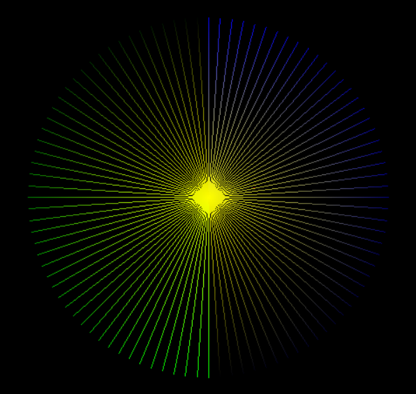
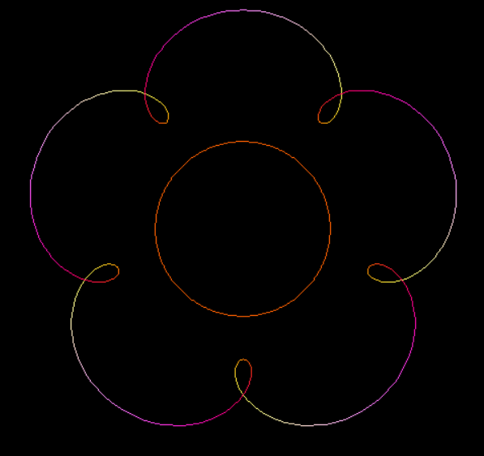
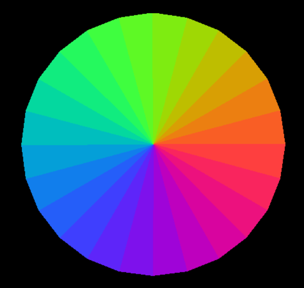
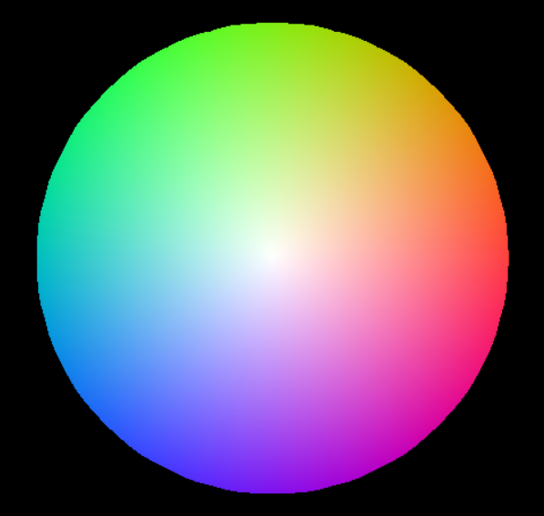
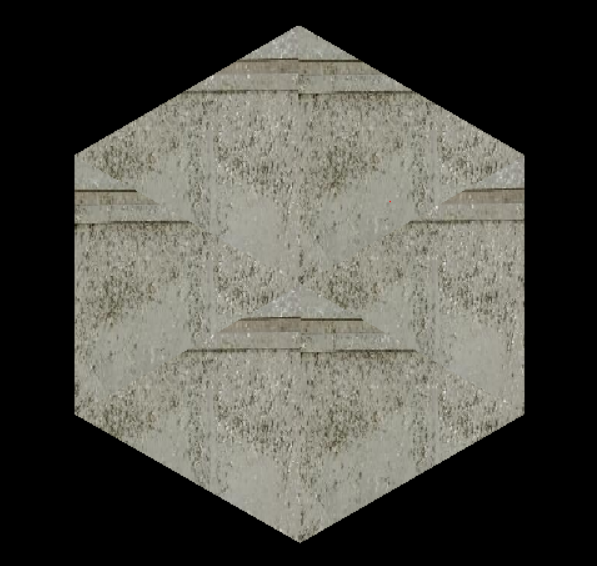

# Bresenham-Lines-and-Triangles
Functions implementing the Bresenham's lien algorithm and extending it to triangles

## Prerequisite classes:
* Buff:
    * A Class to store canvas data. 
    * Size would be Width x Height.
    * Each entry will store a pixel color in (R, G, B). A Color can be represented by a `ColorType` class instance.
    * Needs a function `getPoint(x, y)` to return the Point at (x, y).

* Point:
    * Class to represent an (x, y) point.
    * Also stores the color at the point, using the `ColorType` class.

* ColorType:
    * Class to represent the color in R, G, B.

## Config constants
Config constants are passes in a dict called `config`.
Following key value pairs can be passed inside config:
* `doSmooth`: Boolean. If the colors should be smoothly transitioned. If it's false then the first vertex color is applied to all points.
* `doTexture`: Boolean. If the image texture should be appled instead of color.
* `texture`: Buff. An image texture loaded into a Buff instance.

## Drawing Lines
* `sketch_line()` can be used to plot a line between two points.
It expects a **Buff object**, a function to plot a point, the two line end points, and a config dict as it's arguments.
* The function to plot a point, called `drawPoint()` expects the buff object, and the point as it's arguments.
* `sketch_line()` uses a function to iterate over the iterator returned by the `bresenhams_line()` function. The `bresenhams_line()` function is a generator whicch *yields* a point on every iteration. Each point also has the interpolated color between the two end points, calculated using `interpolate_color()`.

## Drawing Triangles
* `sketch_triangle()` can be used to plot a triangle between three points. It expects a Buff object, a function to plot a point, the three points, and a config dict as arguments.
* It uses `bresenhams_line()` function to iterate over the triangle edges, and then to draw parallel lines in between to fill the triangle. 

## Examples
1) Concentric Lines

2) Flower

3) Flat colored triangles

4) Shaded triangles

5) Textured triangles
